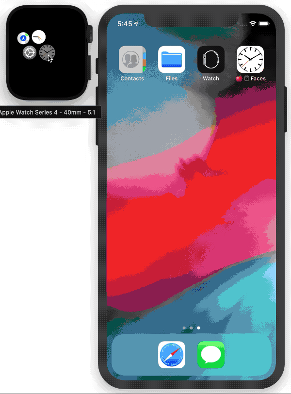
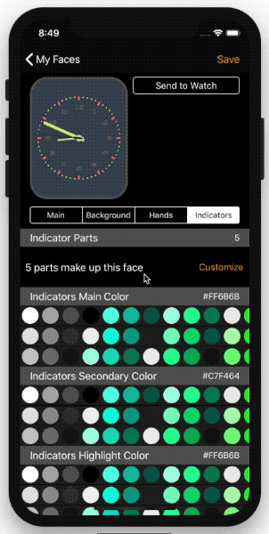

# AppleWatchFaces
**Design your own watch faces for the apple watch. They are not *real* watch faces, but a watchOS app running on the watch that tells you the time.**

The iOS app allows for the user to create **their own** watch faces by choosing from hands and adding in common watch face "indicators" like rings of circles or a little date label.  Additionally, you can add a new face to your list and choose from pre-defined "themes" of colors or indicators/hands from the default watch faces. 

To see what type of default faces it comes with, browse the [thumbnails folder](https://github.com/orff/AppleWatchFaces/tree/master/Shared/Resources/defaultThumbnails), here are some examples:

</img> </img> </img> </img>

## Frequently Asked Questions

1. **Can I download this from the app store ?**

At this time, Apple is not ready for developer created watch faces -- **Typical response from Apple if you submit an iOS app that has a watch face:**

Guideline 4.2.4 - Design - Minimum Functionality

We continued to notice that your Apple Watch app is primarily a clock app with time-telling functionality, which provides a lower quality user experience than Apple users expect. Specifically, users must launch the app or swipe through glances to see the time.

The native clock app already allows users to customize how time is displayed on their devices and offers the best possible time-telling experience. Users are able to switch colors, add more functionality and complications on a watch face such as an alarm, the weather, stocks, activity rings, moon phases, or sunrises and sunsets. Users also have the ability to tap on certain complications to get more information from their corresponding apps.

We encourage you to review your Apple Watch app concept and incorporate different content and features that are in compliance with the [App Store Review Guidelines](https://developer.apple.com/app-store/review/guidelines/), as well as the [watchOS Human Interface Guidelines](https://developer.apple.com/watchos/human-interface-guidelines/). If you want to show the time in your Apple Watch app, you may use the specialized Date Labels to display time-related values on Apple Watch.

2. **Can I join your testFlight and help you beta test?**

No. Apple also will block developers from *external* beta testing because of the H.I.G. ( see FAQ 1 ). If you have a large developer team ( which I do not ), then you might be able to do an *internal* beta test on testflight.

3. **How do I get this on my phone / watch?**

Follow the installation instructions below to compile from the source and you can *side load* this application onto your phone and watch.

4. **How can I create my own watch hands?**

  Currently the watch hands are using UIKit paths and has support for PNGs.  See the example **SecondHandTypes.SecondHandTypeFancyRed** in Shared/Nodes/MinuteHand.swift.  The code will attempt to tint the PNG pixels with the chosen hand color.  White pixels will colorize to the chosen color, and black wil not tint at all.  Colors in between will blend. 
  
5. **Can I use my own background images from my phone in the app?**

  Yes, tap on the camera icon in the background color picker to pull an image off the phone's camera or gallery.

6. **How can I add my own images for use as a background in the watch faces ?**

    1. Crop the image to a square at approximately 312x390 pixels ( 72 ppi )
    2. Drop it into the **/Shared/Resources/Materials** folder ( add to the project )
    3. Add it into the /Shared/AppUISettings file materialFiles array
    
7. **Which versions of apple watches does this work with ?**

Any watchOS that can run spriteKit should be fine.

8. **Are you planning to do complications ?**

Currently the app supports date/time and battery "decorators" that do their best to stay out of the way of the other items that make up the watch face rings.

9. **Are all the designs round  ?**

In [PR 11](https://github.com/orff/AppleWatchFaces/pull/11) support for rounded rectangle designs was added. It it not a perfect solution for watch designs:  While it does postiion the items along a rounded rectangle path, it evenly distributes them which does not perfectly line up with the watch hands.  Also box / square shapes look weird just rotated to face the center vs. a "true" watch design which would mask the edges.  

10. **What about digital clocks  ?**

In [PR 18](https://github.com/orff/AppleWatchFaces/pull/18) added support for date/time labels as "indicators" in the iOS editor app.  Add them and edit settings appropriately.

11. **Can I back up, edit, or restore my faces?**

See Back-Up / Restore in the Usage section below.

## Installation / Side Load

Some users are having limited success installing the ad-hoc IPA file in the [releases](https://github.com/orff/AppleWatchFaces/releases) using tools like impactor and app DBPro.  For best results, sign up as an Apple developer and side-load:

1. Install [Xcode](https://itunes.apple.com/us/app/xcode/id497799835?mt=12) on your mac

1. Open a Terminal instance and go to your working directory

1. Do 
<code>git clone https://github.com/orff/AppleWatchFaces.git</code>

1. Navigate to the "AppleWatchFaces" folder in your working directory

1. Open AppleWatchFaces.xcodeproj in Xcode

1. Run on your device:
1. Make sure you have an Apple developer account
1. Select your development team under the `Signing` area for each target (`AppleWatchFaces`, `face`, and `face (notifications)`)
1. Change the `Bundle Identifier` for each of the above targets to something unique. For example, `AppleWatchFaces` uses `com.mikehill.applewatchfaces`, so change that to something like `com.YOUR_USERNAME.applewatchfaces` 
1. *important note:* Bundle identifiers for watch extensions are really specific.  `face` uses `com.mikehill.applewatchfaces.watchkit`  & `face (notifications)` uses `com.mikehill.applewatchfaces.watchkit.extension`
1. Select the `face` scheme in the top left corner with your devices selected and run.

If you are still having issues, please check out a [sideloading tutorial](http://osxdaily.com/2016/01/12/howto-sideload-apps-iphone-ipad-xcode/) on OSXDaily.

## Usage

### iOS App

1. The main view is for previewing all the faces and deciding if you want to edit one of the them.  You can create a new one with the *create* button or tap *edit* to re-order or delete.  Tapping *send all to watch* will send all current designs to the watch and go to the first one.
1. On the editor view, you can modify settings for that watch face, like the colors, hands, or indicators ( the parts that make up the face like the shapes and numbers that the hands point to ).  
1. On the editor view, swipe left and right to go to other faces in the list and swipe up to preview this design on the watch: this the same as the tapping the watch button in the toolbar
1. On the indicators view you can edit the shapes and numbers that make up the face backgrounds.  The designs are rendered on the watch as shapes like circle or squares and text numbers that are *rings* from the outside to the inside of the watch face.  By editing the list of shapes and text items and *empty space* items, you can change the design of the items in the face and see in the preview watch on the top.

5. You can also just choose from pre-defined *color themes* or *indicator themes* which will override current color or parts with known good settings

6. Undo / Redo if you make a mistake.  
7. Tapping Save in the upper right will lock in these settings in the main list and regenerate the thumbnail.  
8. To abort all current changes tap back without tapping save.

### Back-Up / Restore My Settings

If you need to re-install, or just want to manually edit the settings file. Use iTunes file sharing to save or overwrite the userClockSettingsV[XX].json file.  

### Watch App

1. When AppleWatchFaces is open on the watch, use the digital crown to cycle through the different designs in the iOS app.

2. Set your watch to wake on last activity

1. Open the Settings app  on your Apple Watch.
2. Go to General > Wake Screen, and make sure Wake Screen on Wrist Raise is turned on.
3. Scroll down and choose when you want your Apple Watch to wake to the last app you used: Always, Within 1 Hour of Last Use, Within 2 Minutes of Last Use, or While in Session (for apps like Workout, Remote, or Maps).
4. Choose While in Session if you want your Apple Watch to always wake to the watch face (except when you’re still using an app).
5. You can also do this using the Apple Watch app on your iPhone: Tap My Watch, then go to General > Wake Screen.

3. Keep the Apple Watch display on longer

1. Open the Settings app  on your Apple Watch.
2. Go to General > Wake Screen, then tap Wake for 70 Seconds.

## Known Issues

Sometimes when sending to watch the watch app crashes -- I think this has to do with using resources folders vs. Asset folders in spriteKit, but I have not had time to dive into it.

## Authors

- Mike Hill - [@orffy](https://twitter.com/orffy)

## License

`AppleWatchFaces` is released under the GPL-3 license. See [LICENSE](https://github.com/orff/AppleWatchFaces/blob/master/LICENSE) for details.
